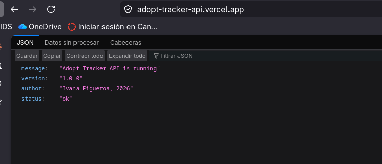
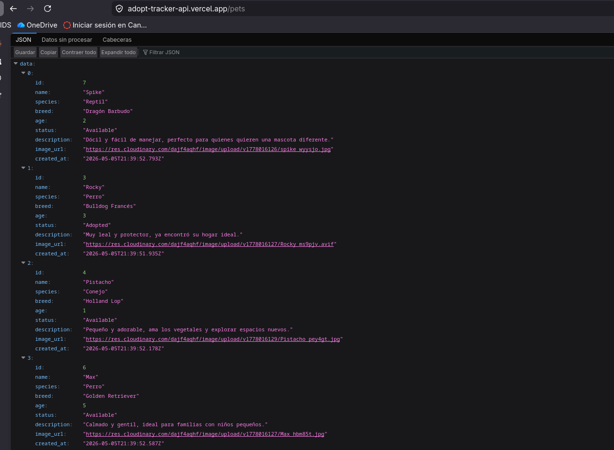
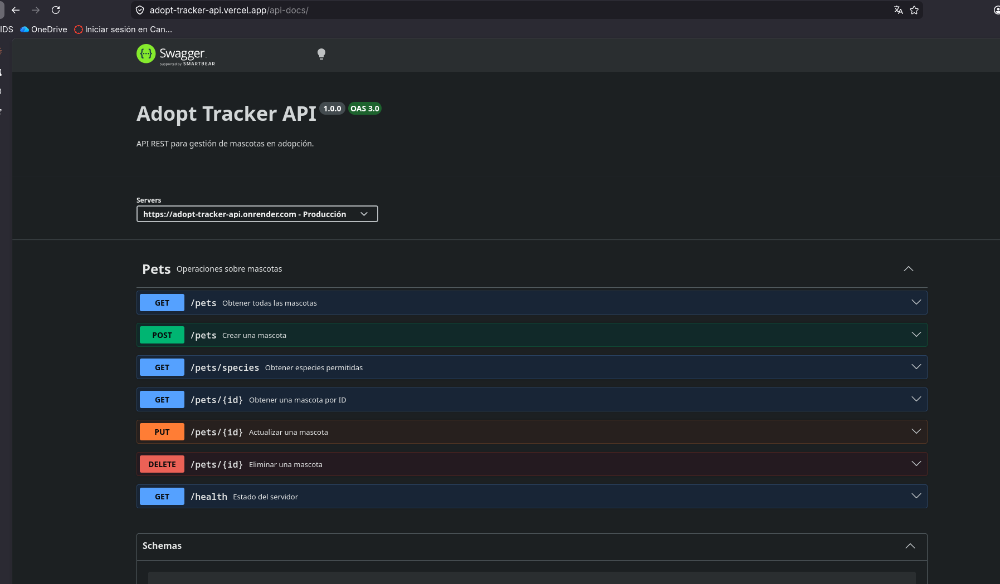

# Adopt Tracker API

API REST para la gestión de mascotas en adopción. Permite registrar, consultar, actualizar y eliminar mascotas, con soporte para búsqueda, paginación, ordenamiento y subida de imágenes.

## Tecnologías

- **Node.js** + **Express**
- **PostgreSQL** (Supabase)
- **Cloudinary** (almacenamiento de imágenes)
- **Swagger UI** (documentación interactiva)

## Screenshots






## Funcionalidades

- CRUD completo de mascotas
- Búsqueda por nombre o especie (`?q=`)
- Filtro por especie exacta (`?species=`)
- Paginación (`?page=` `?limit=`)
- Ordenamiento (`?sort=` `?order=`)
- Subida de imágenes con validación de formato y tamaño (máx. 1MB)
- Validación de especies permitidas
- Documentación interactiva con Swagger UI

## Endpoints

| Método | Ruta | Descripción |
|--------|------|-------------|
| GET | `/pets` | Obtener todas las mascotas |
| GET | `/pets/:id` | Obtener una mascota por ID |
| GET | `/pets/species` | Obtener especies permitidas |
| POST | `/pets` | Crear una mascota |
| PUT | `/pets/:id` | Actualizar una mascota |
| DELETE | `/pets/:id` | Eliminar una mascota |
| GET | `/health` | Estado del servidor |

### Query params de `GET /pets`

| Param | Descripción | Default |
|-------|-------------|---------|
| `q` | Buscar por nombre o especie | — |
| `species` | Filtrar por especie (`Perro`, `Gato`, `Conejo`, `Ave`, `Reptil`, `Otro`) | — |
| `sort` | Campo de ordenamiento (`name`, `age`, `status`) | `name` |
| `order` | Dirección (`asc` / `desc`) | `desc` |
| `page` | Número de página | `1` |
| `limit` | Resultados por página | `10` |

## Correr localmente

### 1. Clonar el repositorio

```bash
git clone https://github.com/IvanaFD/Proyecto-web-backend.git
cd Proyecto-web-backend
```

### 2. Instalar dependencias

```bash
npm install
```

### 3. Configurar variables de entorno

Copia `.env.example` a `.env` y completa los valores:

```bash
cp .env.example .env
```

### 4. Crear la tabla

```bash
node scripts/migrate.js
```

### 5. Cargar datos de prueba

```bash
node scripts/seed.js
```

### 6. Iniciar el servidor

```bash
npm run dev
```

El servidor corre en `http://localhost:3000`.

## Deploy

API desplegada en Vercel:
```
https://adopt-tracker-api.vercel.app
```

Documentación interactiva:

```
https://adopt-tracker-api.vercel.app/api-docs

```



## CORS

CORS es una política de seguridad del navegador que bloquea peticiones a un origen distinto al de la página; en este proyecto se configuró el paquete `cors` de Express para permitir el origen del cliente (`CLIENT_URL`) con los métodos GET, POST, PUT, DELETE y OPTIONS.

## Challenges implementados

- Spec de OpenAPI/Swagger escrita en YAML y precisa
- Swagger UI corriendo y siendo servido desde el backend (`/api-docs`)
- Códigos HTTP correctos en toda la API (201 al crear, 204 al eliminar, 404 si no existe, 400 en input inválido)
- Validación server-side con respuestas de error descriptivas en JSON
- Paginación en `GET /pets` con `?page=` y `?limit=`
- Búsqueda por nombre o especie con `?q=`
- Ordenamiento con `?sort=` y `?order=`
- Subida de imágenes con validación de formato y tamaño (máx. 1MB, almacenadas en Cloudinary)
- Organización del código en capas (rutas, controladores, modelos, middleware)

## Reflexión

Era la primera vez que usaba Supabase, Cloudinary y Swagger en un mismo proyecto. Supabase resultó muy cómodo para tener una base de datos PostgreSQL sin configurar un servidor propio, y Cloudinary simplificó bastante el manejo de imágenes. Swagger costó más de entender al principio, especialmente la sintaxis del YAML, pero una vez configurado es muy útil para documentar y probar los endpoints. La desventaja más notoria fue trabajar con Vercel en un backend Express: al correr como funciones serverless las conexiones a la base de datos se comportan distinto que en un servidor tradicional, y eso generó algunos problemas. Lo usaría de nuevo, pero para producción real elegiría un entorno de servidor persistente.

## Repositorio cliente

```bash
https://github.com/IvanaFD/adopt-tracker-cliente
```